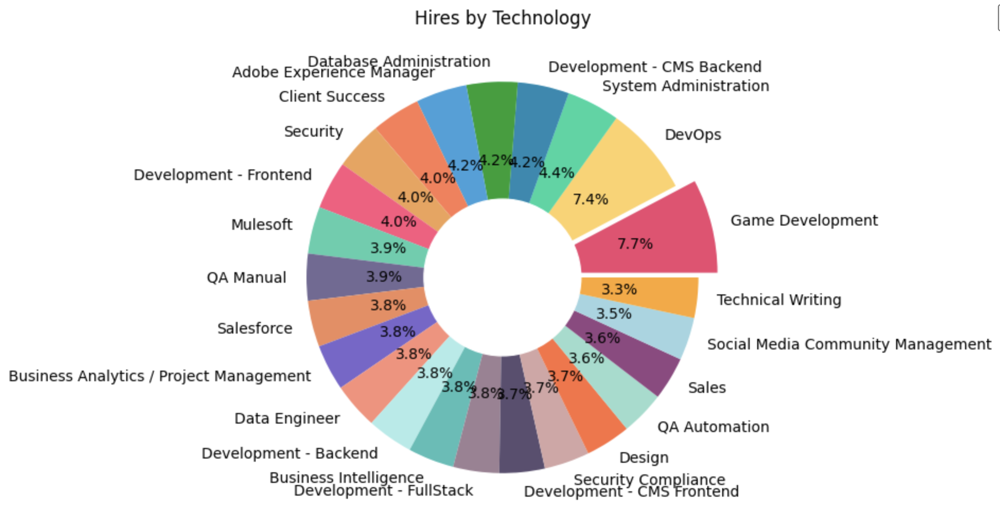
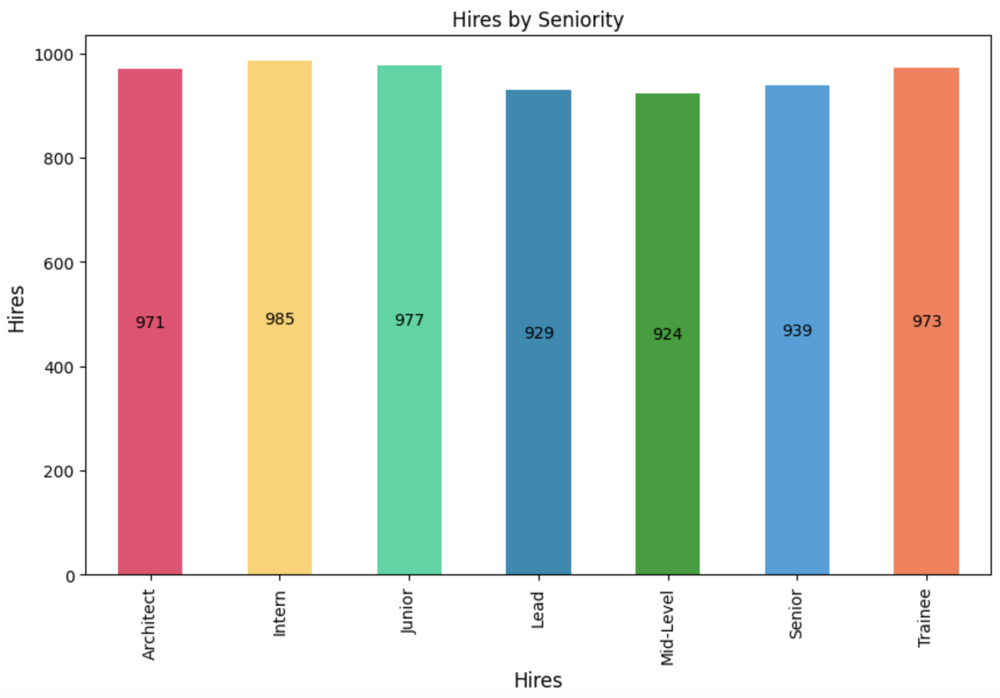
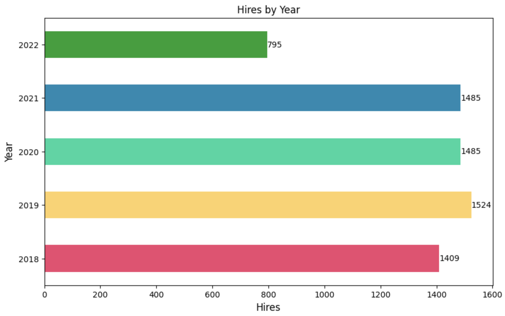
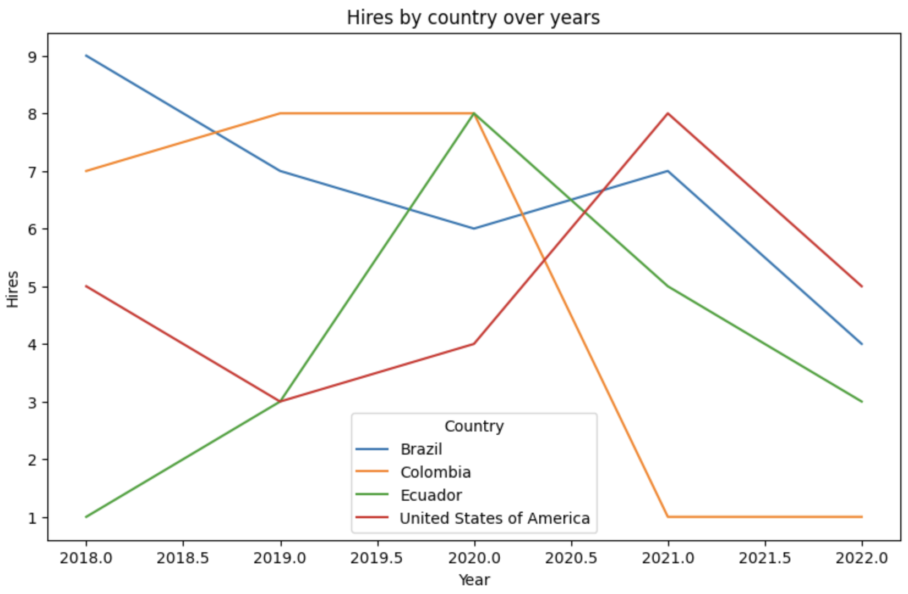

# Candidates ETL and Dataviz - Challenge
 This repo contains the setup of a database and a ETL process to load a CSV data sample to it and then create dataviz for it.

## Enviromment Setup
 ### Setup Virtual Environment
 To create, activate and setup a virtual environment run:
 ```bash
 python3.11 -m venv ./venv
 source ./venv/bin/activate
 pip install --U pip
 pip install -r requirements.txt
```

### Postgres spark jar
The jar for the postgres JDBC spark driver is downloaded from this [link](https://jdbc.postgresql.org/download/postgresql-42.5.4.jar) and then added to the `./spark/jars` folder.


## Database and Candidates data

### Credentials
Create you database credentials on a `.env` file:
```bash
POSTGRES_USER="your_user_name"
POSTGRES_PASSWORD="your_user_password"
POSTGRES_DB="your_database_name"
```

### Docker Service
Then, to start the postgres service run:
```bash
docker-compose up -d
```

### Load Candidates Data
To check if the database is up, you can try to connect to it using a Database Manager like Dbeaver.
In order to load the candidates csv data to it, run the `candidates_etl.py`. This will create a `candidates` table on the database.

## Data Visualizations
Run the cells on `candidates_visualizations.ipynb` to get the following visualizations

### Hires by Technology

### Hires by Seniority

### Hires by Year

### Hires by Country by Year
